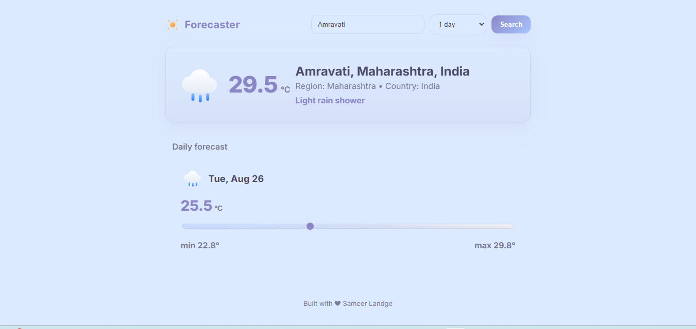
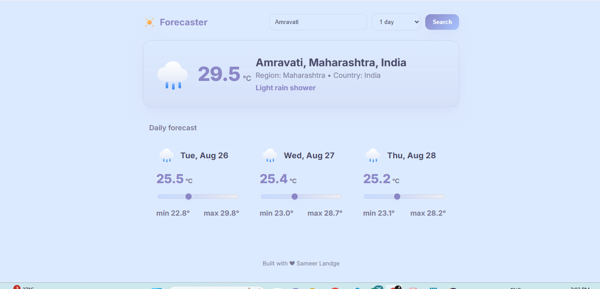
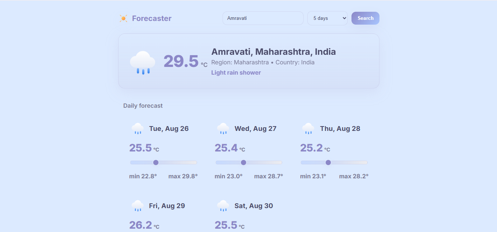
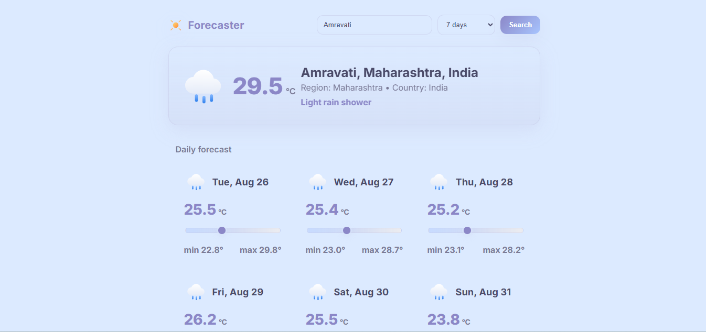

# Forecaster

A Spring Boot REST API application that provides current weather data and weather forecasts for cities worldwide using the WeatherAPI service.

## Features

- Get current weather information for any city
- Retrieve weather forecasts for multiple days
- RESTful API endpoints with JSON responses
- Cross-origin resource sharing (CORS) enabled
- Comprehensive error handling

## Technologies Used

- **Java 17**
- **Spring Boot 3.5.5**
- **Spring Web**
- **Maven**
- **WeatherAPI** (External API)

## API Endpoints

### 1. Test Endpoint
```
GET /weather/{city}
```
Returns a simple test response.

### 2. Current Weather
```
GET /weather/my/{city}
```
Returns current weather information for the specified city.

**Response:**
```json
{
  "city": "London",
  "region": "City of London, Greater London",
  "country": "United Kingdom",
  "condition": "Partly cloudy",
  "temperature": "15.0"
}
```

### 3. Daily Weather Forecast
```
GET /weather/response?city={cityName}&days={numberOfDays}
```
Returns current weather along with daily forecasts.

**Parameters:**
- `city` (required): City name
- `days` (required): Number of forecast days (1-10)

**Response:**
```json
{
  "weatherResponse": {
    "city": "London",
    "region": "City of London, Greater London", 
    "country": "United Kingdom",
    "condition": "Partly cloudy",
    "temperature": "15.0"
  },
  "dayTemp": [
    {
      "date": "2024-08-26",
      "minTemp": 12.5,
      "maxTemp": 18.2,
      "avgTemp": 15.1
    }
  ]
}
```

## Setup and Installation

### Prerequisites
- Java 17 or higher
- Maven 3.6+

### Installation Steps

1. **Clone the repository**
   ```bash
   git clone https://github.com/your-username/Forecaster.git
   cd Forecaster
   ```

2. **Configure API Key**
   - Get a free API key from [WeatherAPI](https://www.weatherapi.com/)
   - Update `src/main/resources/application.properties`:
   ```properties
   spring.application.name=Forecaster
   server.port=9090
   weather.api.key=YOUR_API_KEY_HERE
   weather.api.url=http://api.weatherapi.com/v1/current.json
   weather.api.Forecast.url=http://api.weatherapi.com/v1/forecast.json
   ```

3. **Build the application**
   ```bash
   mvn clean install
   ```

4. **Run the application**
   ```bash
   mvn spring-boot:run
   ```

The application will start on `http://localhost:9090`
---
## 📸 Screenshots






